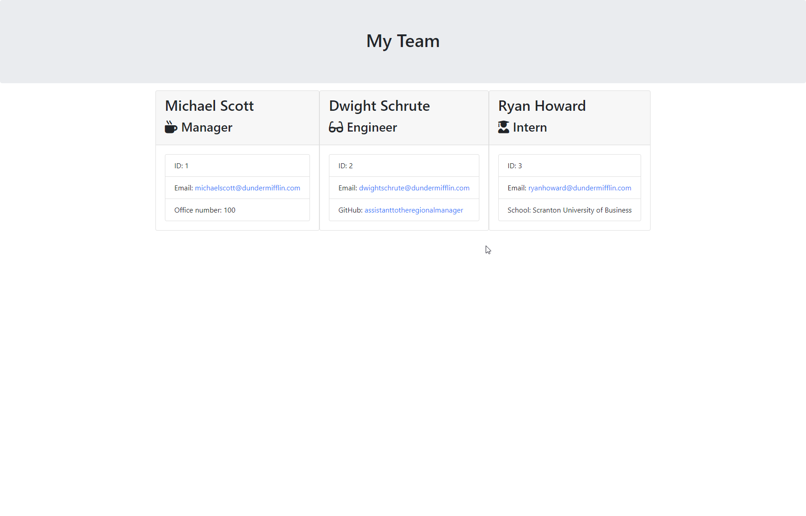
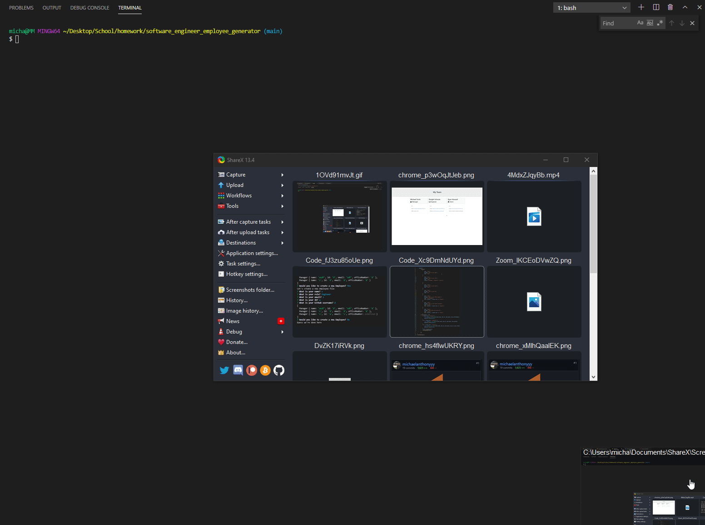

# Software Engineer Employee Generator


## Summary
Using a command line, this employee generator will prompt users for team information based on each individual employees information. Each team consists of a manager as well as engineers and interns. After each employee is created, users are then prompted on whether they want to add more members or if they want to render all of the information to a html page containing all of the information of the team. 

<br>
<br>

## Example 






[Link to Demo Video](https://github.com/michaelanthonyyy/README_generator/blob/main/Assets/employeeegenerator_demo.mp4)
<br>
<br>


## Requirements To Run
The "Inquirer" npm package must be installed for the readme.md generator to function properly.
While in Terminal or GitBash depending on your OS, run the command, "npm install inquirer."
After the "Inquirer" packages have been installed, readme.md generator can be used by running the "node index.js" command. 

<br>
<br>

## Code Snippet
```javascript
function createEmployee() {
    inquirer
        .prompt([
            {
                type: "input",
                message: "What is your name?",
                name: "name",
            },
            {
                type: "list",
                message: "What is your role?",
                name: "role",
                choices: ["Manager", "Engineer", "Intern"]

            },
            {
                type: "input",
                message: "What is your email?",
                name: "email",
            },
            {
                type: "input",
                message: "What is your ID?",
                name: "id",
            },
            {
                type: "input",
                message: "What is your Office Number?",
                name: "officeNumber",
                when: (answer) => answer.role === "Manager",
            },
            {
                type: "input",
                message: "What is your Github username?",
                name: "github",
                when: (answer) => answer.role === "Engineer",
            },
            {
                type: "input",
                message: "What school do you go to?",
                name: "school",
                when: (answer) => answer.role === "Intern",
            }
        ]).then((data) => {
            if (data.role == "Manager") {
                const manager = new Manager(data.name, data.id, data.email, data.officeNumber)
                employees.push(manager);
            }
            else if (data.role == "Engineer") {
                const engineer = new Engineer(data.name, data.id, data.email, data.github)
                employees.push(engineer);
            } 
            else if (data.role == "Intern") {
                const intern = new Intern(data.name, data.id, data.email, data.school)
                employees.push(intern);
            }
            console.log(employees)
            createNewEmployee();

        })
}
```
This code snippet is how Employees are generated and pushed to the employees array that contains all created employees as objects to be rendered into an output html. I tried several different methods to get this code to work going from switch statements for the role specific questions to using the inquirer's "when" which is a much cleaner and easier way to push all the information correctly. 

<br>
<br>

## Built Using

* [Node.js](https://nodejs.org/en/)
* [JSON](https://www.json.org/json-en.html)
* [Inquirer](https://www.npmjs.com/package/inquirer)
* [Jest](https://jest.js.io/)

<br>
<br>

## Author

**Michael Medina** 
- [Link to Github](https://github.com/michaelanthonyyy)
- [Link to LinkedIn](https://www.linkedin.com/in/michael-medina-22aa70200?lipi=urn%3Ali%3Apage%3Ad_flagship3_profile_view_base_contact_details%3B311BosSLTMS4JkhAfkX61A%3D%3D)
- [Link to Portfolio](https://michaelanthonyyy.github.io/portfolio2021/)

<br>
<br>

## LICENSES

Copyright (c) 2021 MIT LICENSE